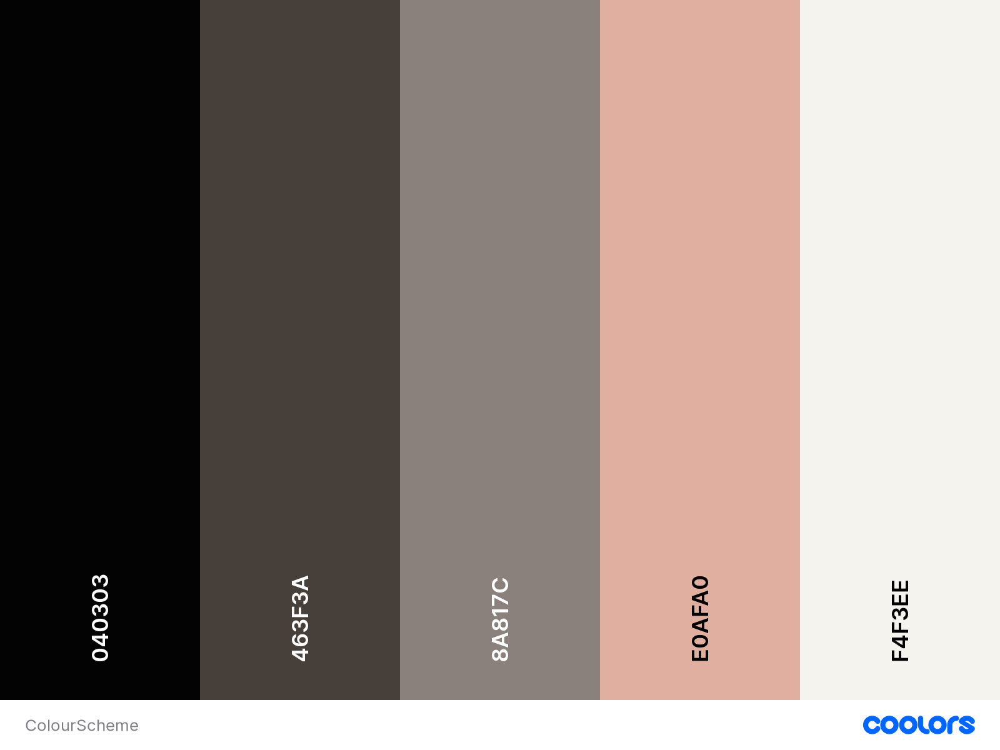

# Quizzically
## Introduction

Welcome to Quizzically, a general knowledge quiz with three degrees of difficulty: easy, medium and hard. This quiz is suitable for anyone above the age of 5, and is an interactive website that allows the user to select the correct answer out of 4 multiple choices. 

---
## UX (user experience)

### Goals
* Aesthetic website.
* Interactive quiz.
* 3 levels of difficulty in questions.
* Valuable and accurate content.
* Scores to be presented. 

### User's Stories
* As a user, I want to be able to pick my required level of difficulty. 
* As a user, I want to be able to be able to see tally of incorrect and correct answers.
* As a user, I want to be able to be able to see if my answer is incorrect when submitted. 
* As a user, I want to be able to reset my quiz and pick different degrees of difficulty.
* As a user, I want to be able to retry a quiz and not having repeating questions. 

### Site Owner's Goals
* I want to be able to provide challenge user's with the questions. 
* I want to entice the user to visit and stay on the page.
* I want to provide a playful and enjoyable experience for the user. 
* I want to offer the user an interactive way to select the answer. 

### Expectation
* I expect visibility of a tally of correct and incorrect answers. 
* I expect multiple choice answers to be presented to the user, one of which is correct.
* I expect the reset button to function correctly to restart the quiz with different questions.
* I expect contrasting elements to stand out when compared to the background. 
* I expect when the logo is clicked, the page is refreshed. 

### Requirements
* The quiz must present questions according to the difficulty level selected.
* The quiz must tally the score of incorrect and correct answers. 
* The page must be easy to read.
* The quiz must be interactive and have effects when answers are hovered over.
* All transitions of the page must be consistent throughout.

---
## Design

### Icon
There will two types of icons used for this webpage: 
* [Favicon](https://favicon.io/ "Favicon") will be used as a website identifier, this identifier will be visible on the tab and if the website is bookmarked. A favicon is important as it will give the brand recognition and therefore will make the page more identifiable. 
* [FontAwesome](https://fontawesome.com/ "Font Awesome") will be used for the three categories of difficulty. Furthermore, universal icons will be used meaning the overall user experience will be improved. 

### Font
[Google Fonts](https://fonts.google.com/ "Google Fonts") was used to identify which font would best suit a quiz show. I decided to use the **Rubik** font as it's clear, modern and simplistic. This font will be used for all elements.

### Colour Scheme
The below colour scheme was generated using [Coolor](https://coolors.co/ "Coolers"). Mild and calming colours are used in this quiz as it provides a welcoming feel for the user. Furthermore Complimentary colours are used throughout to marry all the colours together. 

| Colour  | Description |
| ------  | --- |
| #463F3A | This colour will be used for the header bar |
| #8A817C | This colour will be used for the all buttons |
| #040303 | This colour will be used for the text within the quiz. |
| #E0AFA0 | This colour will be used for the answer box. |
| #F4F3EE | This colour will be used for the background and as contrasting text. |
| #256125 | This colour will be used to indicate that the user has answered the question correctly. |
| #d31717 | This colour will be used to indicate that the user has answered the quesiton incorrectly. |

### Breakpoints
No particular breakpoints will be used in the media queries however, the website is responsive to a minimum of 320px. 

### Wireframes
Three wireframes shown below are examples of what the content of the page will look like when displayed on large and small screens. The page will be designed in order to be responsive to all sizes and therefore the large screen and medium screen will exhibit the same presentation with proportional scale. Both wireframes were created using [Mockplus RP](https://www.mockplus.com/mockplus-rp "Mockplus RP").

[Large/Medium Screen](docs/wireframes/large-screen.jpg "Large/Medium Screen")

[Small Screen](docs/wireframes/small-screen.jpg "Small Screen")

---
## Features

## Bug Fixes
| Bug detected | Action |
|--|--|
| When testing using a mobile device, the hover colour of answers clicked remained active | Hover effects and properties were added to media query. |
| Outer parts of the box when clicked doesn't register as a click to the answer | Upon investigation it was discovered that it was due to the transform effect added, this was changed to make it still feel like a button is being clicked but make sure even if the outer most elements are chosen, the click is still registered.  |

## Potential Future Additions
* With more resource and time, I would like to add a feature whereby when the incorrect answer is selected, the correct answer is also shown.
* With more resource and time, I would like to add more category specific questions to the quiz.
* With more resource and time, I would like to add an interface whereby scores can be stored and shared with others
---
## Technologies used
### Languages
* HTML
* CSS
* JavaScript
### Libraries
* [Fontawesome](https://fontawesome.com/ "Font Awesome")
* [Google Fonts](https://fonts.google.com/ "Google Fonts")
### Tools
* [Coolers](https://coolors.co/ "Coolors")
* [Mockplus RP](https://www.mockplus.com/mockplus-rp "Mockplus RP")
* [Git](https://git-scm.com/ "Git")
* [GitHub](https://github.com/ "GitHub")
* [GitPod](https://www.gitpod.io/ "GitPod")

---
## Testing
| Testing |Outcome | Pass or Fail |
|--|--|
| Initiating game by clicking **Easy** button | Easy quiz game started. | Pass |
| Initiating game by clicking **Medium** button | Medium quiz game started. | Pass |
| Initiating game by clicking **Hard** button | Hard quiz game started. | Pass |
| Hover over all **difficulty** buttons | Hover colour change observed | Pass |
| In developer mode, **change screen sizes** while in **home page** | Home page is responsive and legible | Pass |
| Clicking **home** button on all **questions** in each difficulty | Home page loaded. | Pass |
| Clicking **Quizzically! logo** on every **question** in each difficulty | Home page loaded. | Pass |
| Clicking **end game** button on all **questions** in each difficulty. | Summary screen displayed | Pass |
| Hovering **over home** and **end game** buttons | White coloured hover observed | Pass |
| Upon progressing through the quiz, check the **HUD** response | HUD in all difficulties were responsive. | Pass |
| Hover over all **answer boxes** | Hover colour change observed | Pass |
| Click any **incorrect** answer in each question across all difficulties | Answer box colour changed to red. | Pass |
| Click any **correct** answer in each question across all difficulties | Answer box colour changed to green. | Pass |
| Click answers **multiple times** prior to new question being loaded | No response | Pass |
| In developer mode, **change screen sizes** while in **game screen** for all questions and difficulties | Game screen is responsive and legible | Pass |
| Complete **all questions** in the quiz | Summary screen is loaded | Pass |
| Score from a range of **0 to 10** in the game | Summary screen score is the number of questions answered correctly. | Pass |
| Complete the quiz and obtain a result of **< 3** | Feedback of quiz is appropriate | Pass |
| Complete the quiz and obtain a result of **< 7** | Feedback of quiz is appropriate | Pass |
| Complete the quiz and obtain a result of **> 7** | Feedback of quiz is appropriate | Pass |
| Hover over all social media icons | White hover colour observed | Pass |
| Click each social media icon | New tab opened with the correct website | Pass |
| Clicking **home** button on the **summary** screen | Home page loaded. | Pass |
| Clicking **Quizzically! logo** on the **summary** screen | Home page loaded. | Pass |
| In developer mode, **change screen sizes** while in **summary screen** | Summary screen is responsive and legible | Pass |
| Click **any** button in the quiz | animation of size transform observed | Pass |
| **Hover** over all buttons in the quiz | Mouse tranformed to a pointer | Pass |

### W3C CSS validator

[CSS validation testing](docs/screenshots/css-testing.png "CSS Validation testing")

### W3C HTML validator

[HTML validation testing](docs/screenshots/html-testing.jpg "HTML validation testing")

### Jshint validation

[JavaScript validation testing](docs/screenshots/js-testing.jpg "JavaScript validation testing")

### Lighthouse testing

[Desktop lighthouse testing](docs/screenshots/lighthouse-desktop.jpg "Desktop lighthouse testing")

[Mobile lighthouse testing](docs/screenshots/lighthouse-mobile.jpg "Mobile lighthouse testing")
## Deployments
Post completion of coding, the project was added, committed and pushed to github. The github repository was made live completing the following steps:

* Click on the **project repository**.

* Then click on the **settings** section.

* Then select **pages** under the code and automation section in the side navigation bar.

* Change the source to **deplay from a brand**.

* Select the branch `Main/ (root)` and press **save**.

* The website is live on the following link: `https://YOURUSERNAME.github.io/YOURPROJECTNAME/`

* Any future changes can be completed by **adding**, **committing** and **pushing** updates to github.
---
## Credits
* [Simen Daehlin](https://www.linkedin.com/in/simendaehlin/) - Assistance throughout the project
* [James Q Quick](https://www.youtube.com/watch?v=u98ROZjBWy8&list=PLDlWc9AfQBfZIkdVaOQXi1tizJeNJipEx&ab_channel=JamesQQuick) - used as guidance into how to build a quiz.
* [Ania Kubów](https://www.youtube.com/watch?v=zgHim4ZDpZY&t=1908s&ab_channel=CodewithAniaKub%C3%B3w) - used as a guide to learn how to fetch API.
* [Geek Probin](https://www.youtube.com/watch?v=-cX5jnQgqSM&t=418s&ab_channel=GeekProbin) - used as a guide to understand how to check if answers were correct.
---
## Inspirations
* [JavaScript Quiz](https://javascriptquiz.com/)
* [Lovatts puzzles](https://lovattspuzzles.com/online-puzzles-competitions/ultimate-online-trivia-quiz/)