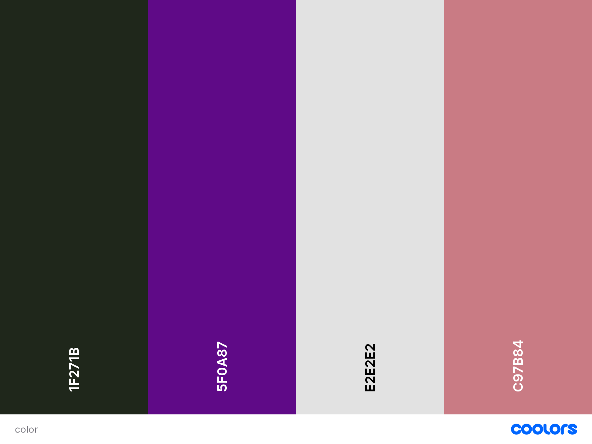

# Quizzically
## Introduction

Welcome to Quizzically, a general knowledge quiz with three degrees of difficulty: easy, medium and hard. This quiz is suitable for anyone above the age of 5, and is an interactive website that allows the user to select the correct answer out of 4 multiple choices. 

---
## UX (user experience)

### Goals
* Aesthetic website.
* Interactive quiz.
* 3 levels of difficulty in questions.
* Valuable and accurate content.
* Scores to be presented. 

### User's Stories
* As a user, I want to be able to pick my required level of difficulty. 
* As a user, I want to be able to be able to see tally of incorrect and correct answers.
* As a user, I want to be able to be able to see if my answer is incorrect when submitted. 
* As a user, I want to be able to reset my quiz and pick different degrees of difficulty.
* As a user, I want to be able to retry a quiz and not having repeating questions. 

### Site Owner's Goals
* As the site owner, I want to be able to provide challenge user's with the questions. 
* As the site owner, I want to entice the user to visit and stay on the page.
* As the site owner, I want to provide a playful and enjoyable experience for the user. 
* As the site owner, I want to offer the user an interactive way to select the answer. 

### Expectation
* I expect visibility of a tally of correct and incorrect answers. 
* I expect multiple choice answers to be presented to the user, one of which is correct.
* I expect the reset button to function correctly to restart the quiz with different questions.
* I expect contrasting elements to stand out when compared to the background. 
* I expect when the logo is clicked, the page is refreshed. 

### Requirements
* The quiz must present questions according to the difficulty level selected.
* The quiz must tally the score of incorrect and correct answers. 
* The page must be easy to read.
* The quiz must be interactive and have effects when answers are hovered over.
* All transitions of the page must be consistent throughout.

---
## Design

### Icon
There will two types of icons used for this webpage: 
* [Favicon](https://favicon.io/ "Favicon") will be used as a website identifier, this identifier will be visible on the tab and if the website is bookmarked. A favicon is important as it will give the brand recognition and therefore will make the page more identifiable. 
* [FontAwesome](https://fontawesome.com/ "Font Awesome") will be used for the three categories of difficulty. Furthermore, universal icons will be used meaning the overall user experience will be improved. 

### Font
[Google Fonts](https://fonts.google.com/ "Google Fonts") was used to identify which font would best suit a quiz show. I decided to use the 'Rubik' font as it's clear, modern and simplistic. This font will be used for all headers. The next font used in the website will be 'Open Sans'. This font is popular among most websites and will be used for the presentation of questions and answers. A variety of strengths will and font sizes will be used throughout depending on the situation. 

### Colour Scheme
The below colour scheme was generated using [Coolor](https://coolors.co/ "Coolers"). Strong colours are used in this quiz as a clear distinction is required for the questions and answers. Complimentary colours are then used to tone out the colours so that they aren't too bold. 

| Colour  | Description |
| ------  | --- |
| #1F271B | This colour will be used for the header bar and submit buttons. |
| #5F0A87 | This colour will be used for the question box. |
| #E2E2E2 | This colour will be used for the text in all sections. |
| #C97B84| This colour will be used for the answer box. |

### Breakpoints
No particular breakpoints will be used in the media queries however, the website is responsive to a minimum of 320px. 

### Wireframes
Three wireframes shown below are examples of what the content of the page will look like when displayed on large, medium and small screens.

Large Screen

Medium Screen

Small Screen

---
## Features

## Potential Future Additions
---
## Technologies used
### Languages
* HTML
* CSS
* JavaScript
### Tools
* [Coolers](https://coolors.co/ "Coolors")
* [Git](https://git-scm.com/ "Git")
* [GitHub](https://github.com/ "GitHub")
* [GitPod](https://www.gitpod.io/ "GitPod")
### Libraries
* [Fontawesome](https://fontawesome.com/ "Font Awesome")
* [Google Fonts](https://fonts.google.com/ "Google Fonts")
---
## Testing
---
## Deployments
Post completion of coding, the project was added, committed and pushed to github. The github repository was made live completing the following steps:

* Click on the **project repository**.

* Then click on the **settings** section.

* Then select **pages** under the code and automation section in the side navigation bar.

* Change the source to **deplay from a brand**.

* Select the branch `Main/ (root)` and press **save**.

* The website is live on the following link: `https://YOURUSERNAME.github.io/YOURPROJECTNAME/`

* Any future changes can be completed by **adding**, **committing** and **pushing** updates to github